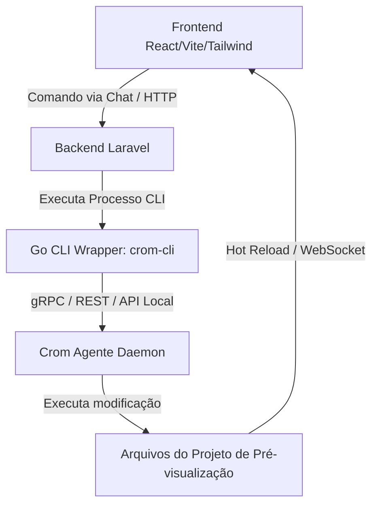

# Arquitetura do Sistema

O **Crom Nextline Editor** adota uma arquitetura desacoplada e modular de microsserviços rodando localmente para oferecer soberania técnica e rapidez de resposta.

## Componentes Principais

### 1. Frontend (React + Vite + Tailwind CSS v4)
- **Interface Split-Screen:**
  - Lado esquerdo: Painel de chat interativo com IA e visualização do console de logs.
  - Lado direito: Um Canvas do tipo `iframe` renderizando o site local em tempo real.
- **Interatividade:**
  - Permite alterar a visualização para modo Desktop, Tablet e Mobile.
  - Recebe atualizações em tempo real (via WebSockets ou polling do Laravel) quando novos arquivos são salvos pela IA.

### 2. Backend (Laravel 11)
- **Responsabilidades:**
  - Expõe uma API REST para que o frontend envie os comandos do chat (ex: "Adicionar seção de contato").
  - Centraliza o controle de sessão e histórico de alterações.
  - Orquestra a execução do processo nativo CLI do Go (`crom-cli`) usando o componente de processos do PHP.

### 3. Wrapper CLI (Go)
- **Por que Go?**
  - Execução ultra rápida e compilação em um binário nativo estático e leve.
  - Facilidade de consumo pelo PHP no Laravel através de comandos de console simples.
- **Função:**
  - Atua como uma ponte de comunicação com o `crom-agente-sdk` e o daemon do `crom-agente` rodando localmente.
  - Recebe o comando do Laravel, despacha a tarefa de edição para a IA e retorna a resposta formatada para o Laravel.

### 4. Crom Agente (`crom-agente` & `sdk`)
- **Papel:**
  - O agente de código autônomo.
  - Lê o contexto dos arquivos do site de demonstração, cria o plano de edição, injeta/modifica os códigos fonte do site e salva o resultado final no disco.
