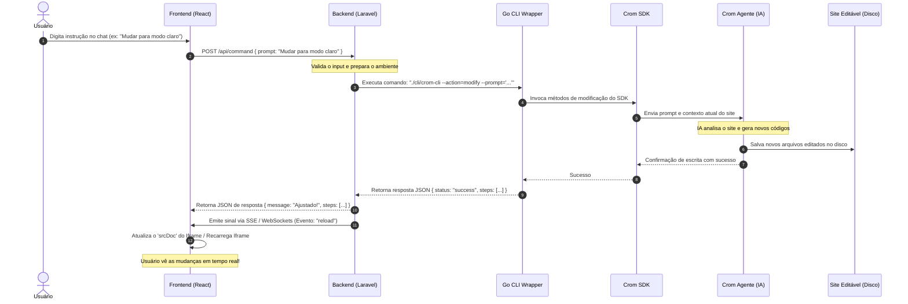

# Roadmap do Sistema e Fluxo de Funcionamento

Este documento descreve o roadmap técnico, a especificação das rotas, as APIs do backend e o funcionamento detalhado ponta a ponta do **Crom Nextline Editor AI**.

---

## 🗺️ Visão Geral do Fluxo de Operação

O fluxo de funcionamento do sistema é baseado em eventos assíncronos que coordenam o chat, a orquestração do Laravel, a execução em Go e a atualização em tempo real do visualizador (Iframe).



---

## 🎨 Frontend & Roteamento (Roadmap)

### 1. Estrutura de Telas e Rotas
Como a aplicação é um painel administrativo/editor de tela única, utilizaremos um sistema de abas e um roteador minimalista (React Router ou estado de abas locais):
- `/` - **Dashboard/Editor Principal:** A tela de split-screen padrão.
- `/settings` - **Configurações:** Configurações de conexão do `crom-agente` local e variáveis de ambiente.

### 2. Gerenciamento de Estado
O estado centralizado no frontend cuidará de:
- **Histórico do Chat:** Coleção de mensagens com remetente, conteúdo e *stepper* de status do agente.
- **Preview Viewport:** Alternar entre `desktop` (w-full), `tablet` (w-[768px]) e `mobile` (w-[375px]).
- **Aba Ativa da Barra Lateral:** `Chat de Comando`, `Editor de Código` e `Logs do Terminal`.
- **HMR Listener:** Ouvinte de conexões de eventos para recarregar o iframe sempre que receber um sinal de modificação do disco.

---

## 🔌 API do Backend Laravel (Roadmap)

Abaixo estão os endpoints que o backend expõe para servir a aplicação React:

### 1. Processar Comando do Chat
- **Rota:** `POST /api/command`
- **Payload (JSON):**
  ```json
  {
    "prompt": "Adicionar seção de contato no final da página"
  }
  ```
- **Resposta (JSON):**
  ```json
  {
    "status": "success",
    "message": "Adicionei uma seção de contato moderna na parte inferior.",
    "steps": [
      "Processado por Laravel",
      "Binário Go compilado e executado",
      "Crom Agente reescreveu index.html",
      "Hot-reload disparado para o visualizador"
    ]
  }
  ```

### 2. Buscar Arquivos do Projeto (Editor de Código)
- **Rota:** `GET /api/files`
- **Resposta (JSON):**
  ```json
  {
    "files": {
      "index.html": "...",
      "index.css": "...",
      "agent-config.json": "..."
    }
  }
  ```

### 2b. Endpoints de Runtime e Arquivos (implementados)

Além do fluxo de comando, o backend expõe as rotas que sustentam o editor e o ciclo de vida do preview:

| Método | Rota | Descrição |
| :--- | :--- | :--- |
| `GET` | `/api/files?workspace_id=` | Árvore de arquivos recursiva do workspace. |
| `GET` | `/api/file?workspace_id=&path=` | Conteúdo de um arquivo (com bloqueio de path traversal). |
| `PUT` | `/api/file` | Salva edição manual de um arquivo. |
| `GET` | `/api/workspaces/{id}/status` | Estado real do contêiner, reconciliado com o Docker. |
| `GET` | `/api/workspaces/{id}/logs` | Logs do contêiner de preview (`docker logs`). |
| `POST` | `/api/workspaces/{id}/start` | Detecta a stack e sobe o contêiner correto. |
| `POST` | `/api/workspaces/{id}/stop` | Para e remove o contêiner. |

### 3. Canal de Eventos em Tempo Real (SSE)
- **Rota:** `GET /api/events`
- **Descrição:** Uma conexão persistente Server-Sent Events (SSE) para enviar alertas ao frontend, como a notificação de que o site foi editado e precisa ser recarregado:
  ```text
  data: {"event": "reload", "file": "index.html"}
  ```

---

## ⚙️ Funcionamento Interno (Laravel ➔ Go CLI ➔ SDK)

### O Papel do Laravel
O Laravel serve como o cérebro orquestrador. Ele não executa a IA diretamente; em vez disso, executa o binário Go CLI de forma isolada usando a biblioteca de processos do PHP:
```php
use Symfony\Component\Process\Process;

$process = new Process(['./cli/crom-cli', '--action=modify', '--prompt=' . $prompt]);
$process->run();

if ($process->isSuccessful()) {
    $output = json_decode($process->getOutput(), true);
    // Retorna para o frontend
}
```

### O Papel do Go CLI (`crom-cli`)
Escrito em Go para performance ideal e tamanho reduzido, ele importa o SDK do Crom Agente. Sua execução é instantânea e o consumo de recursos é mínimo, apenas chamando os endpoints gRPC/REST do daemon `crom-agente` rodando no container Docker ou localmente.
