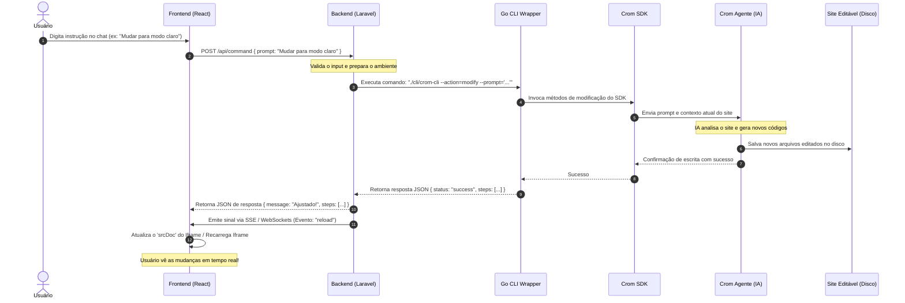

# Roadmap do Sistema e Fluxo de Funcionamento

Este documento descreve o roadmap técnico, a especificação das rotas, as APIs do backend e o funcionamento detalhado ponta a ponta do **Crom Nextline Editor AI**.

---

## 🗺️ Visão Geral do Fluxo de Operação

O fluxo de funcionamento do sistema é baseado em eventos assíncronos que coordenam o chat, a orquestração do Laravel, a execução em Go e a atualização em tempo real do visualizador (Iframe).



---

## 🎨 Frontend & Roteamento

### 1. Estrutura de Telas e Rotas React
A aplicação utiliza o `react-router-dom` para gerenciar as seguintes rotas da SPA:
- `/` - **Página Inicial (Home):** Apresentação e links rápidos.
- `/sobre` - **Sobre o Crom Nextline:** Explicação institucional.
- `/login` - **Página de Login:** Autenticação via Laravel Sanctum.
- `/dashboard` - **Listagem de Workspaces:** Gerenciamento centralizado de projetos do cliente.
- `/workspace/create` - **Criação Detalhada:** Interface com cards de stacks interativos e slug generator.
- `/workspace/:id` - **Editor Principal (Split-Screen):** Editor com árvore de arquivos, preview e chat multithread.
- `/configuracoes` - **Configurações do Usuário:** Gestão de perfil e consulta de pontos.

### 2. Gerenciamento de Estado
O estado centralizado no frontend cuida de:
- **Histórico do Chat Multithread (threads):** Lista de chats salvos e ativos persistida no `localStorage`.
- **Preview Viewport:** Alternar entre `desktop` (w-full), `tablet` (w-[768px]) e `mobile` (w-[375px]).
- **Logs do Terminal:** Log consolidado do Laravel, Go CLI e Crom Agente.
- **Árvore de Arquivos e Arquivo Aberto:** Renderizado recursivamente.

---

## 🔌 API do Backend Laravel

O backend expõe a seguinte estrutura de rotas protegidas por middleware Sanctum (ou abertas para autenticação):

### 1. Autenticação
- `POST /api/login` — Autenticação de clientes e administradores, retorna o token de acesso Sanctum.
- `POST /api/logout` — Revogação de tokens de acesso.

### 2. Gestão de Workspaces e Contêineres
- `GET /api/workspaces` — Lista os workspaces do usuário logado.
- `POST /api/workspaces` — Cria um novo workspace e inicializa a estrutura (scaffold).
- `GET /api/workspaces/{id}/status` — Retorna o estado real (Docker inspect) do contêiner do workspace.
- `POST /api/workspaces/{id}/start` — Detecta a stack e inicia o contêiner de preview correspondente.
- `POST /api/workspaces/{id}/stop` — Para e remove o contêiner de preview.
- `GET /api/workspaces/{id}/logs` — Captura os logs do contêiner Docker.

### 3. Editor e Arquivos
- `GET /api/files?workspace_id=` — Árvore de arquivos recursiva.
- `GET /api/file?workspace_id=&path=` — Lê o conteúdo de um arquivo (com proteção contra traversal).
- `PUT /api/file` — Salva a edição manual de um arquivo realizada no editor.
- `POST /api/reset` — Restaura os arquivos do workspace para o template de scaffold inicial.

### 4. Processamento de Comandos (IA)
- `POST /api/command` — Recebe o prompt do usuário, valida o saldo de pontos, invoca a Go CLI (`crom-cli`) e cobra os pontos.
  - **Payload (JSON):**
    ```json
    {
      "prompt": "Adicionar seção de contato",
      "workspace_id": "uuid-aqui",
      "model": "google/gemini-2.5-flash"
    }
    ```

### 5. Configurações Globais (Admin)
- `GET /api/settings` — Obtém parâmetros como chaves OpenRouter e modelos permitidos.
- `POST /api/settings` — Salva configurações globais.
- `GET /api/client-points` — Obtém saldo do usuário.
- `POST /api/client-points/add` — Credita pontos a um cliente.

---

## ⚙️ Funcionamento Interno (Laravel ➔ Go CLI ➔ SDK)

### O Papel do Laravel
O Laravel serve como o cérebro orquestrador. Ele não executa a IA diretamente; em vez disso, executa o binário Go CLI de forma isolada usando a biblioteca de processos do PHP:
```php
use Symfony\Component\Process\Process;

$process = new Process([
    $binaryPath,
    '--action=modify',
    '--prompt=' . $prompt,
    '--workspace=' . $workspacePath,
    '--model=' . $model,
    '--file=' . $targetFile
]);
$process->run();

if ($process->isSuccessful()) {
    $output = json_decode($process->getOutput(), true);
    // Retorna para o frontend
}
```

### O Papel do Go CLI (`crom-cli`)
Escrito em Go para performance ideal e tamanho reduzido, ele importa o SDK do Crom Agente. Sua execução é instantânea e o consumo de recursos é mínimo, apenas chamando os endpoints gRPC/REST do daemon `crom-agente` rodando no container Docker ou localmente.
