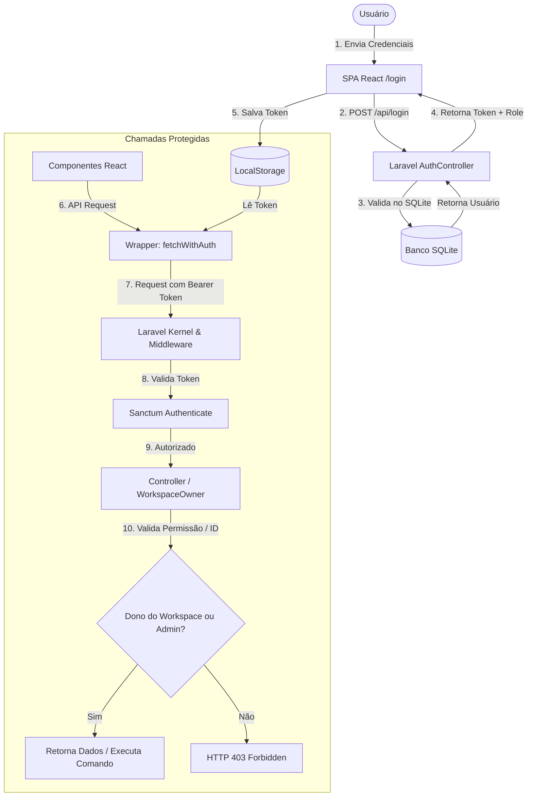
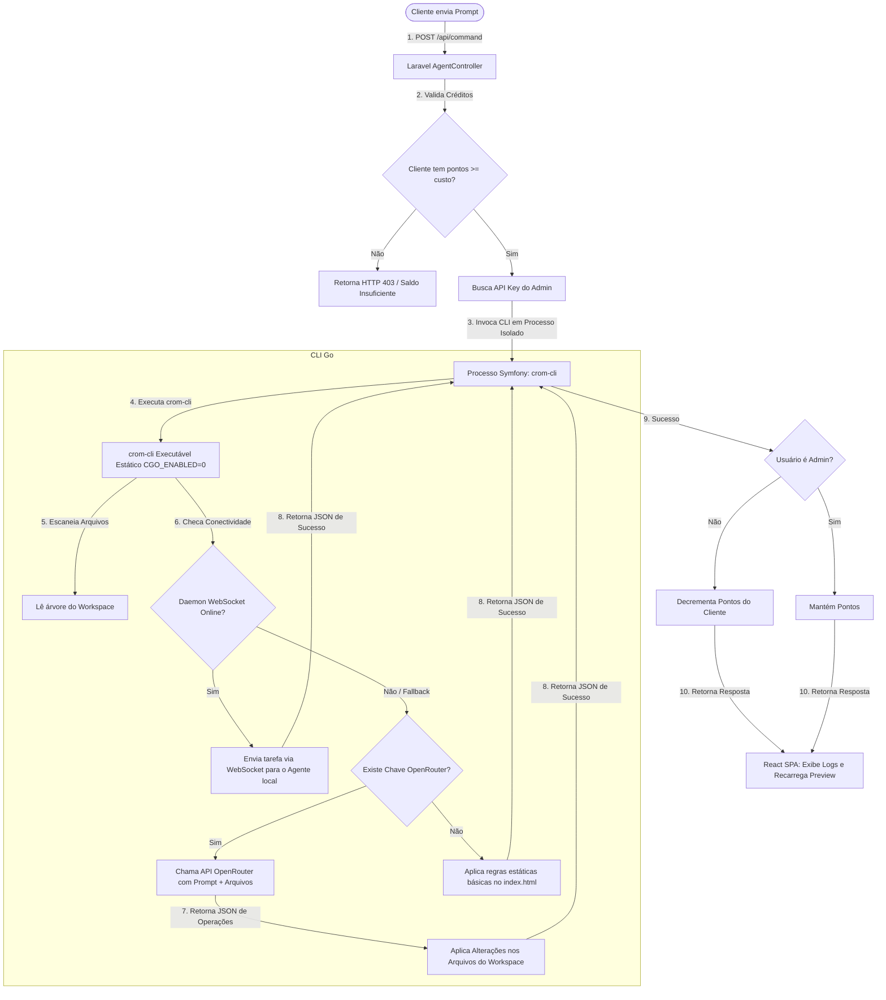
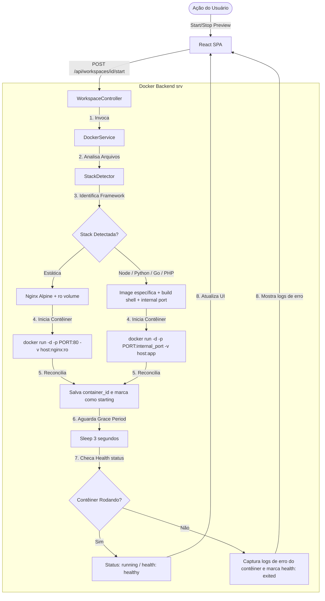

# Arquitetura e Fluxo do Sistema Crom Nextline Editor AI

Este documento detalha o funcionamento interno de toda a plataforma, cobrindo o fluxo de autenticação e autorização (Sanctum), a cadeia de execução de comandos via CLI Go integrado à IA, e o ciclo de vida dos contêineres Docker isolados.

---

## 🔐 1. Fluxo de Autenticação e Segurança (Sanctum & Roles)

O sistema utiliza o Laravel Sanctum para emissão de tokens API protegidos e controle de acesso baseado em papéis (`admin` vs `client`).



---

## ⚙️ 2. Pipeline de Execução de Comandos (O Agente de IA)

O fluxo a seguir ilustra o que ocorre quando o cliente digita um prompt no chat do editor para modificar o site.



---

## 🐳 3. Ciclo de Vida do Contêiner de Preview (Docker)

Cada workspace possui seu próprio ciclo de vida Docker isolado para rodar e visualizar o site em tempo real.



---

## 🌐 4. Roteamento de Previews por URL Amigável / Subdomínio

O sistema permite configurar de maneira extremamente flexível a forma como os previews dos workspaces são acessados na plataforma, através de duas variáveis de ambiente no arquivo [backend/.env](file:///home/j/Documentos/GitHub/crom-nextline-editor-ai/backend/.env):

```env
# Tipo de URL de preview: 'port' (legado via porta dedicada), 'path' (URL amigável por pasta) ou 'subdomain' (por subdomínio)
PREVIEW_URL_TYPE=path
# URL base do servidor Laravel para servir os arquivos estáticos dos previews
PREVIEW_BASE_URL=http://localhost:8000
```

### Funcionamento do Slug
Ao criar um workspace, uma coluna `slug` única é automaticamente gerada com base no nome do projeto (ex: `Academia Fitness` vira `academia-fitness`). As URLs amigáveis utilizam este slug para localizar o workspace na base de dados.

### Modos de Visualização:
1. **Modo Path (`PREVIEW_URL_TYPE=path`):**
   * O preview será servido na rota pública: `http://localhost:8000/preview/{slug}/{path?}`.
   * O iframe do editor apontará para esta rota unificada que lê os arquivos da pasta do workspace diretamente.
   * **Fallback para stacks dinâmicos:** Para projetos não-estáticos (Node, PHP puro, Django, etc.), a URL reverte automaticamente para a porta dedicada `http://localhost:{port}`. Isso evita que arquivos de assets relativos fujam da raiz da URL e quebrem na renderização.
2. **Modo Subdomínio (`PREVIEW_URL_TYPE=subdomain`):**
   * O preview será servido na rota de subdomínio dinâmico: `http://{slug}.localhost:8000/{path?}`.
   * O roteador do Laravel `routes/web.php` intercepta a requisição usando `Route::domain()` e serve os arquivos.
   * **Reverse Proxy:** Para stacks dinâmicas, o Laravel atua como um proxy reverso transparente encaminhando as chamadas HTTP diretamente para a porta interna do contêiner Docker ativo, unificando a experiência sob o subdomínio.
3. **Modo Port (`PREVIEW_URL_TYPE=port`):**
   * Comportamento legado que utiliza portas dedicadas por projeto (ex: `http://localhost:9003`).

---

## 🤖 5. Seleção Dinâmica de Modelos de IA

Os modelos de IA disponibilizados pelo administrador através do painel de controle são consumidos dinamicamente pelos clientes no chat do editor de código:

1. **Definição pelo Admin:** O administrador ativa/desativa modelos permitidos (como Gemini 2.0 Flash, Llama 3.3, DeepSeek V3) no painel administrativo, salvando a lista na tabela `settings`.
2. **Descoberta pelo Cliente:** O editor de códigos do frontend ([WorkspaceEditor.tsx](file:///home/j/Documentos/GitHub/crom-nextline-editor-ai/frontend/src/pages/WorkspaceEditor.tsx)) consome a API `/settings` e carrega dinamicamente a lista de modelos ativos em uma caixa de seleção (`select`) posicionada acima do prompt de envio de comandos.
3. **Envio e Execução:** Ao disparar um prompt, o frontend envia a escolha do modelo no corpo da requisição POST `/api/command`. O backend propaga a escolha para a CLI Go, instruindo a LLM do OpenRouter a processar os arquivos com o modelo selecionado (ex: `google/gemini-2.0-flash-001`).

