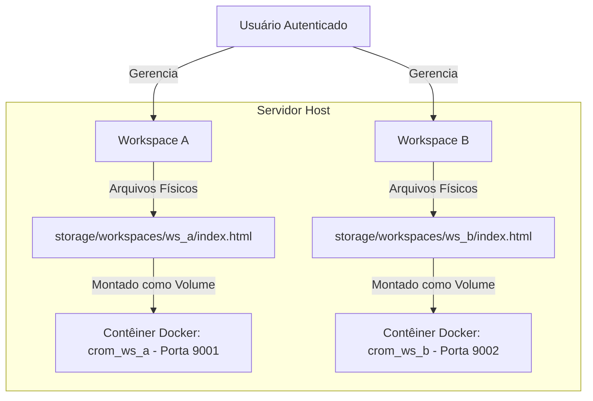

# Arquitetura de Multi-Workspaces e Dockerização Dinâmica

Este documento detalha o funcionamento técnico, o fluxo de dados e a arquitetura para gerenciar múltiplos projetos (Workspaces) de forma isolada, rodando cada preview em seu próprio contêiner Docker.

---

## 💡 O Conceito de Workspace

Um **Workspace** representa um projeto web individual criado por um usuário. Para garantir que um projeto não interfira no outro, implementamos um isolamento em duas camadas:
1. **Isolamento de Arquivos (Storage):** Cada projeto possui seu próprio diretório físico no disco sob `backend/storage/app/workspaces/{workspace_id}/`.
2. **Isolamento de Execução (Preview):** Cada projeto possui um contêiner Docker dedicado rodando um servidor web leve (Nginx) exposto em uma porta exclusiva no host (ex: `9001`, `9002`...).



---

## 🐳 Controle Dinâmico do Docker (Docker-out-of-Docker)

Para permitir que a aplicação Laravel (que já roda dentro de um contêiner Docker) crie e gerencie contêineres Docker de pré-visualização para os usuários, mapeamos o socket do Docker do host para dentro do contêiner do Laravel:
- **Volume:** `/var/run/docker.sock:/var/run/docker.sock`

Isso permite que o Laravel execute comandos da CLI do Docker no host através do shell ou APIs do Docker.

### Ciclo de Vida dos Contêineres de Preview:

1. **Criação do Workspace:**
   - Laravel gera um UUID para o Workspace.
   - Cria o diretório `storage/app/workspaces/{id}` e copia um template padrão (`index.html`).
   - Aloca uma porta livre no host (ex: a partir da porta `9001`).

2. **Início do Preview (Start):**
   - Laravel executa o comando para instanciar o servidor web para o projeto:
     ```bash
     docker run -d --name crom_ws_{id} -p {host_port}:80 -v {absolute_path}:/usr/share/nginx/html:ro nginx:alpine
     ```
   - Altera o status do workspace no banco de dados para `running`.

3. **Modificação (Edição de Código):**
   - O usuário digita alterações no chat.
   - Laravel chama o binário em Go `crom-cli` apontando para o caminho específico do Workspace:
     ```bash
     ./cli/crom-cli --action=modify --workspace=/var/www/frontend/public/preview-site/workspaces/{id} --prompt="Adicionar contato"
     ```
   - O Crom Agente edita o arquivo no disco. Como o diretório está montado como volume no contêiner de preview do Nginx, a alteração é instantânea!

4. **Parada do Preview (Stop / Delete):**
   - Para liberar recursos do sistema, o Laravel encerra o contêiner do preview quando inativo ou excluído:
     ```bash
     docker stop crom_ws_{id} && docker rm crom_ws_{id}
     ```
   - Altera o status para `stopped`.

---

## 💾 Modelagem do Banco de Dados

### Tabela `workspaces`
Armazena a relação de projetos cadastrados no sistema:

| Coluna | Tipo | Descrição |
| :--- | :--- | :--- |
| `id` | `UUID` (Primary Key) | Identificador único do projeto. |
| `user_id` | `ForeignKey` | ID do usuário dono do projeto. |
| `name` | `String` | Nome do projeto (ex: "Meu Site de Pizza"). |
| `port` | `Integer` | Porta exclusiva no host alocada para o preview (ex: `9001`). |
| `status` | `Enum` (`running`, `stopped`) | Status de execução do contêiner Docker. |
| `path` | `String` | Caminho absoluto da pasta do projeto. |
| `created_at` / `updated_at` | `Timestamp` | Datas de criação e atualização. |

---

## 🔌 Especificação de Rotas API

As seguintes rotas são adicionadas no [routes/api.php](file:///home/j/Documentos/GitHub/crom-nextline-editor-ai/backend/routes/api.php) para gerenciar esta arquitetura:

### 1. Listar Projetos
- **GET** `/api/workspaces`
- **Retorno:** Lista de workspaces do usuário logado.

### 2. Criar Novo Projeto
- **POST** `/api/workspaces`
- **Payload:** `{ "name": "Nome do Site" }`
- **Retorno:** Detalhes do workspace criado e a porta alocada.

### 3. Iniciar Contêiner de Preview
- **POST** `/api/workspaces/{id}/start`
- **Ação:** Laravel roda o comando `docker run` para subir o Nginx do projeto.
- **Retorno:** `{ "status": "running", "preview_url": "http://localhost:9001" }`

### 4. Parar Contêiner de Preview
- **POST** `/api/workspaces/{id}/stop`
- **Ação:** Laravel roda `docker stop` e `docker rm` no contêiner correspondente.
- **Retorno:** `{ "status": "stopped" }`
